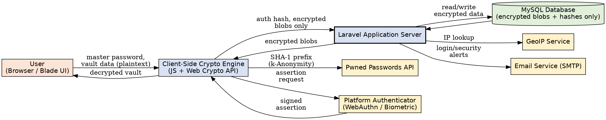
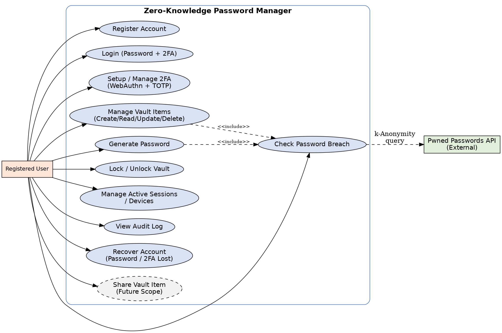
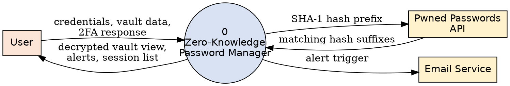
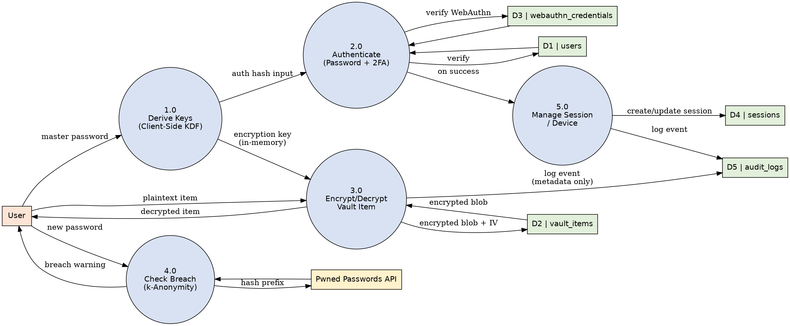

# Software Requirements Specification
## Zero-Knowledge Password Manager

*Prepared in accordance with IEEE Std 830-1998*
**Version 1.0**

---

## Table of Contents

1. [Introduction](#1-introduction)
   1.1 [Purpose](#11-purpose)
   1.2 [Scope](#12-scope)
   1.3 [Definitions, Acronyms, and Abbreviations](#13-definitions-acronyms-and-abbreviations)
   1.4 [References](#14-references)
   1.5 [Overview](#15-overview)
2. [Overall Description](#2-overall-description)
   2.1 [Product Perspective](#21-product-perspective)
   2.2 [Product Functions](#22-product-functions)
   2.3 [User Characteristics](#23-user-characteristics)
   2.4 [Constraints](#24-constraints)
   2.5 [Assumptions and Dependencies](#25-assumptions-and-dependencies)
3. [Specific Requirements](#3-specific-requirements)
   3.1 [External Interface Requirements](#31-external-interface-requirements)
   3.2 [Functional Requirements](#32-functional-requirements)
   3.3 [Performance Requirements](#33-performance-requirements)
   3.4 [Design Constraints](#34-design-constraints)
   3.5 [Software System Attributes](#35-software-system-attributes)
   3.6 [Other Requirements](#36-other-requirements)
4. [Use Case Model](#4-use-case-model)
5. [Data Flow Diagrams](#5-data-flow-diagrams)
6. [Appendices](#6-appendices)

---

## 1. Introduction

### 1.1 Purpose

This Software Requirements Specification (SRS) defines the functional and non-functional requirements for the **Zero-Knowledge Password Manager**, a web-based credential management application built on Laravel and Blade with client-side cryptography. This document is intended for the development team, project supervisors, and any reviewer requiring a complete, unambiguous specification of the system's intended behavior.

### 1.2 Scope

The Zero-Knowledge Password Manager allows a single user to securely store, retrieve, and manage login credentials for third-party services. The system guarantees that the server never has access to plaintext passwords, notes, or the Master Encryption Key — all sensitive cryptographic operations occur exclusively in the client's browser via the Web Crypto API.

**In scope for the current implementation phase:**

- User registration and Zero-Knowledge key derivation
- Authentication with mandatory Two-Factor Authentication (WebAuthn and/or TOTP)
- Encrypted vault item management (create, read, update, delete)
- Client-side password generation and breach detection (k-Anonymity)
- Auto-lock and biometric/password-based unlock
- Multi-device session management with device revocation
- Privacy-preserving audit logging
- Account recovery via a Recovery Key

**Out of scope for the current phase (Future Scope):**

- Secure password sharing between users (see [FR-11](#fr-11--secure-password-sharing-future-scope))

### 1.3 Definitions, Acronyms, and Abbreviations

| Term | Definition |
|---|---|
| **Zero-Knowledge** | An architecture in which the server stores and processes data without ever having access to its plaintext form or the keys needed to decrypt it. |
| **KDF** | Key Derivation Function — an algorithm that derives cryptographic keys from a password (e.g., PBKDF2, Argon2id). |
| **Master Password** | The single secret the user memorizes; never transmitted to or stored by the server. |
| **Master Key** | The root key derived client-side from the Master Password and `kdf_salt`. |
| **Encryption Key** | A key derived from the Master Key, used to encrypt/decrypt vault items; held only in the client, never persisted server-side. |
| **Auth Hash Input** | A value derived from the Master Key (separately from the Encryption Key) and sent to the server to verify identity. |
| **Recovery Key** | A randomly generated 32-character key that can decrypt a backup copy of the Encryption Key, used for account recovery. |
| **WebAuthn** | A W3C standard enabling public-key-based authentication using biometrics or hardware security keys. |
| **TOTP** | Time-based One-Time Password, typically generated by an authenticator app. |
| **k-Anonymity** | A breach-checking technique where only a hash prefix is sent to a third-party API, preventing exposure of the full password hash. |
| **IV** | Initialization Vector — a random value used with AES-GCM to ensure identical plaintexts produce different ciphertexts. |
| **Vault** | The collection of a user's encrypted credential items. |

### 1.4 References

- IEEE Std 830-1998, *IEEE Recommended Practice for Software Requirements Specifications*.
- OWASP Password Storage Cheat Sheet (2023) — PBKDF2 iteration count recommendations.
- W3C Web Authentication (WebAuthn) Level 2 Specification.
- RFC 6238 — TOTP: Time-Based One-Time Password Algorithm.
- Have I Been Pwned — Pwned Passwords API (k-Anonymity model) documentation.
- Project `ARCHITECTURE.md` (internal design document, prior deliverable).

### 1.5 Overview

Section 2 describes the product at a high level, including its context, functions, users, and constraints. Section 3 specifies detailed functional and non-functional requirements. Section 4 presents use cases describing system-user interactions. Section 5 presents data flow diagrams describing how information moves through the system. Section 6 contains supporting appendices, including the data model.

---

## 2. Overall Description

### 2.1 Product Perspective

The Zero-Knowledge Password Manager is a new, self-contained web application. It is not a component of a larger system, though it follows architectural patterns established in the team's prior work (e.g., the CyberGuard platform's 2FA implementation). The system consists of a Laravel/Blade server-rendered front end augmented with client-side JavaScript cryptography, a Laravel backend API, and a relational database that stores only encrypted or hashed values.

*Figure 2.1 — System Context Diagram*

### 2.2 Product Functions

At a high level, the system provides the following functions (detailed in Section 3.2):

- Zero-Knowledge account registration and authentication
- Mandatory multi-method Two-Factor Authentication
- Encrypted credential vault (CRUD)
- Client-side password generation with breach detection
- Auto-lock with biometric or password-based unlock
- Multi-device session visibility and revocation
- Privacy-preserving activity audit log
- Recovery-Key-based account recovery

### 2.3 User Characteristics

The system targets a single user class: an individual end-user managing their own personal or professional credentials. No administrative or multi-tenant roles are defined in the current scope. Users are assumed to have basic familiarity with password managers and modern browser features (e.g., biometric prompts), but no specialized security expertise is required — the system is designed to enforce best practices transparently on the user's behalf.

### 2.4 Constraints

- All cryptographic operations must use the native Web Crypto API — no external JavaScript cryptography libraries, to minimize supply-chain risk.
- The front end is server-rendered Blade, not a single-page application; the Encryption Key must therefore survive page reloads within a session without being persisted in a readable browser storage API.
- WebAuthn functionality depends on browser and device support; a Master-Password fallback is mandatory wherever WebAuthn is used.
- The system must comply with a strict Content-Security-Policy, restricting inline scripts.

### 2.5 Assumptions and Dependencies

- Users are responsible for safeguarding their Master Password and Recovery Key; the system cannot recover a vault if both are lost.
- The system depends on the availability of the external Pwned Passwords API for breach detection; the feature degrades gracefully (skips the check) if the API is unreachable.
- The system depends on an SMTP provider for security alert emails and a GeoIP service for approximate location resolution.
- Users' browsers are assumed to support the Web Crypto API at minimum; WebAuthn support is treated as optional but recommended.

---

## 3. Specific Requirements

### 3.1 External Interface Requirements

#### 3.1.1 User Interfaces

The system shall provide Blade-rendered web pages for: registration, login, 2FA enrollment/challenge, vault dashboard, item detail/edit, password generator, account recovery, session management, and audit log. The Lock Modal shall be presented as an overlay that blocks interaction with the underlying page without a full navigation/reload.

#### 3.1.2 Hardware Interfaces

Where available, the system interfaces with platform authenticators (fingerprint sensors, facial recognition cameras, or external security keys) via the standard WebAuthn browser API. No direct hardware access is implemented by the application itself.

#### 3.1.3 Software Interfaces

| Interface | Purpose |
|---|---|
| Pwned Passwords API | k-Anonymity breach lookups using a 5-character SHA-1 prefix. |
| GeoIP Service | Resolves an IP address to an approximate city/country for session display and login alerts. |
| SMTP Email Service | Delivers new-device/location login alerts and recovery-related notifications. |
| WebAuthn API (Browser) | Registers and verifies platform/hardware authenticators. |

#### 3.1.4 Communications Interfaces

All client-server communication shall occur over HTTPS/TLS. The API shall exchange JSON payloads containing only ciphertext, hashes, and non-sensitive metadata — never plaintext passwords or encryption keys.

### 3.2 Functional Requirements

#### FR-1 — User Registration
*Allows a new user to create a Zero-Knowledge account.*

| ID | Requirement | Priority |
|---|---|---|
| FR-1.1 | The system shall allow a user to register using an email address and a Master Password. | High |
| FR-1.2 | The client shall generate a unique `kdf_salt` and derive the Master Key entirely client-side using PBKDF2-SHA256 (600,000 iterations). | High |
| FR-1.3 | The client shall derive an Encryption Key and an Auth Hash Input from the Master Key using separate HKDF contexts. | High |
| FR-1.4 | The client shall generate a 32-character random Recovery Key and display it to the user exactly once. | High |
| FR-1.5 | The client shall encrypt the Encryption Key under a key derived from the Recovery Key and submit the result (`encrypted_recovery_blob`) to the server. | High |
| FR-1.6 | The server shall never receive or store the Master Password, the Encryption Key, or the Recovery Key in plaintext. | Critical |
| FR-1.7 | The system shall require the user to enroll at least one Two-Factor Authentication method (WebAuthn and/or TOTP) before granting access to the vault. | High |

#### FR-2 — Authentication & Login
*Verifies user identity without the server ever learning the Master Password.*

| ID | Requirement | Priority |
|---|---|---|
| FR-2.1 | The system shall authenticate users via email + Master Password (Factor 1) followed by a mandatory second factor (Factor 2). | Critical |
| FR-2.2 | The server shall return a decoy `kdf_salt` for unregistered emails to prevent user-enumeration attacks. | High |
| FR-2.3 | The server shall compare a bcrypt hash of the client-submitted Auth Hash Input against the stored value. | High |
| FR-2.4 | The system shall enforce rate limiting on the login endpoint to mitigate brute-force attempts. | Critical |
| FR-2.5 | On successful login, the system shall issue a session with a validity of 24 hours (default) or 7 days ("Remember Me"). | Medium |
| FR-2.6 | The system shall send an email alert only when login occurs from a new device or new location, not on every login. | Medium |

#### FR-3 — Two-Factor Authentication
*Supports both WebAuthn (biometric/hardware) and TOTP (authenticator app), independently or combined.*

| ID | Requirement | Priority |
|---|---|---|
| FR-3.1 | The system shall support WebAuthn registration and verification, allowing multiple credentials per user (e.g., phone, laptop). | High |
| FR-3.2 | The system shall support TOTP-based 2FA, compatible with standard authenticator apps. | High |
| FR-3.3 | The user shall be able to enable both WebAuthn and TOTP simultaneously and choose either at login time. | Medium |
| FR-3.4 | The user shall be able to add or remove individual WebAuthn credentials from their account settings. | Medium |
| FR-3.5 | The system shall label each WebAuthn credential with a user-defined device name for identification. | Low |

#### FR-4 — Vault Item Management
*Create, view, update, and delete encrypted credential records.*

| ID | Requirement | Priority |
|---|---|---|
| FR-4.1 | The system shall allow users to create vault items containing a title, username, password, optional notes, and optional URL. | High |
| FR-4.2 | The client shall encrypt the password and notes fields with AES-256-GCM using a per-item random 12-byte IV before transmission. | Critical |
| FR-4.3 | The server shall store only ciphertext and IV values for sensitive vault fields. | Critical |
| FR-4.4 | The client shall decrypt vault items locally, only while the Encryption Key is present in memory. | Critical |
| FR-4.5 | The system shall allow users to organize vault items into user-defined categories. | Low |
| FR-4.6 | The system shall log a metadata-only audit entry for every vault item create/update/delete action. | Medium |

#### FR-5 — Password Generator
*Generates strong passwords with configurable modes.*

| ID | Requirement | Priority |
|---|---|---|
| FR-5.1 | The system shall generate passwords in three modes: Random String, Memorable Passphrase, and Pronounceable Word. | Medium |
| FR-5.2 | The system shall display the estimated entropy (bits) and approximate crack time for a generated password. | Low |
| FR-5.3 | The system shall automatically check a generated password against known breaches and regenerate it if a match is found. | High |
| FR-5.4 | The system shall retain the last 5 generated passwords in memory only, for the duration of the session. | Low |

#### FR-6 — Breach Detection
*Warns users when a password matches a known data breach, without exposing the password itself.*

| ID | Requirement | Priority |
|---|---|---|
| FR-6.1 | The client shall compute the SHA-1 hash of a candidate password locally. | High |
| FR-6.2 | The client shall transmit only the first 5 characters of the SHA-1 hash to the breach-check API (k-Anonymity). | Critical |
| FR-6.3 | The client shall compare the returned hash suffixes locally and display a warning if a match is found. | High |

#### FR-7 — Auto-Lock & Unlock
*Protects the decrypted vault when the user is inactive.*

| ID | Requirement | Priority |
|---|---|---|
| FR-7.1 | The system shall automatically clear the Encryption Key from memory after 30 minutes of user inactivity. | Critical |
| FR-7.2 | The Encryption Key shall be held as a non-extractable `CryptoKey` object, never in `sessionStorage` or `localStorage`. | Critical |
| FR-7.3 | Upon auto-lock, the system shall display a Lock Modal requiring re-authentication before the vault is accessible again. | High |
| FR-7.4 | If a WebAuthn credential is enrolled on the current device, the system shall offer biometric unlock as the default option. | Medium |
| FR-7.5 | The system shall always offer Master Password entry as a fallback unlock method. | High |
| FR-7.6 | The system shall verify a re-derived Encryption Key by successfully decrypting a stored canary value before restoring vault access. | High |
| FR-7.7 | Users whose only enrolled 2FA method is TOTP shall unlock exclusively via Master Password, since TOTP cannot back key derivation. | Medium |

#### FR-8 — Session & Device Management
*Gives users visibility and control over where their account is logged in.*

| ID | Requirement | Priority |
|---|---|---|
| FR-8.1 | The system shall display a list of active sessions with device name, IP address, approximate location, and last-active time. | High |
| FR-8.2 | The user shall be able to revoke an individual session, immediately invalidating it server-side. | High |
| FR-8.3 | The user shall be able to log out of all devices in a single action. | High |
| FR-8.4 | Access to the session-management page shall require light re-authentication. | Medium |

#### FR-9 — Audit Log
*Provides a transparent, privacy-preserving history of account activity.*

| ID | Requirement | Priority |
|---|---|---|
| FR-9.1 | The system shall log security-relevant events (login, logout, vault changes, 2FA changes, session revocations, recovery use). | High |
| FR-9.2 | Audit log entries shall never contain vault item titles, usernames, passwords, or notes. | Critical |
| FR-9.3 | The user shall be able to view their audit log over a configurable time window. | Medium |
| FR-9.4 | The system shall prune audit log entries older than a defined retention period via a scheduled job. | Low |

#### FR-10 — Account Recovery
*Restores access after a forgotten Master Password or a lost 2FA device, without breaking Zero-Knowledge guarantees.*

| ID | Requirement | Priority |
|---|---|---|
| FR-10.1 | The system shall allow account recovery via a previously issued Recovery Key. | Critical |
| FR-10.2 | The server shall require a partial identity proof (e.g., email OTP) and enforce rate limiting before releasing `encrypted_recovery_blob`. | Critical |
| FR-10.3 | The client shall decrypt `encrypted_recovery_blob` locally using the Recovery Key to recover the Encryption Key. | High |
| FR-10.4 | On password reset, the system shall re-derive a new Auth Hash Input while preserving the existing Encryption Key so the vault remains decryptable. | Critical |
| FR-10.5 | On lost-device recovery, the system shall allow enrollment of a replacement 2FA method and revocation of the lost one. | High |

#### FR-11 — Secure Password Sharing (Future Scope)
*Not included in the current implementation phase; documented for planning purposes.*

| ID | Requirement | Priority |
|---|---|---|
| FR-11.1 | The system shall allow a user to share a vault item with another registered user. | Future |
| FR-11.2 | Sharing shall use asymmetric re-encryption so that shared item contents remain unreadable by the server. | Future |
| FR-11.3 | The owner shall be able to revoke a shared item's access at any time. | Future |

### 3.3 Performance Requirements

- Client-side key derivation shall complete within 1–2 seconds on typical consumer hardware (see NFR table, Section 3.5).
- The system shall support at least 100 concurrent authenticated users on the target deployment environment without perceptible degradation.
- Vault item list retrieval (encrypted) shall return within 500ms under normal load for vaults of up to 500 items.

### 3.4 Design Constraints

- The backend shall be implemented in Laravel, using Laravel Breeze for session/auth scaffolding.
- The Encryption Key shall never be persisted in `sessionStorage`, `localStorage`, or any server-accessible store.
- Database migrations shall follow the schema defined in the project's `ARCHITECTURE.md`.

### 3.5 Software System Attributes

| Category | Requirement |
|---|---|
| Security | All cryptographic operations shall use the native Web Crypto API (`window.crypto.subtle`); no external JS crypto dependencies are permitted. |
| Security | A strict Content-Security-Policy with a per-request nonce shall be enforced on all pages. |
| Security | The Encryption Key shall never be transmitted to, or derivable by, the server. |
| Performance | Client-side key derivation (PBKDF2, 600,000 iterations) shall complete within 1–2 seconds on typical consumer hardware. |
| Performance | Vault item decryption on view shall complete in under 100ms per item. |
| Reliability | Session and audit data shall be persisted in a relational database with standard backup procedures. |
| Usability | The Lock Modal and unlock flow shall clearly distinguish "logged in, vault locked" from "logged out" to avoid user confusion. |
| Maintainability | KDF parameters shall be stored per-user (`kdf_params`) to allow future algorithm upgrades without breaking existing accounts. |
| Portability | The client application shall function on any modern browser supporting the Web Crypto API and, where used, the WebAuthn API. |
| Compliance | The system shall avoid storing personally identifiable vault content in logs, in line with data-minimization principles. |

### 3.6 Other Requirements

**Database:** All persisted sensitive fields (passwords, notes, recovery blobs) shall be stored exclusively as ciphertext.

**Legal/Compliance:** The audit log design shall avoid storing personal vault content, supporting data-minimization principles relevant to privacy regulations.

---

## 4. Use Case Model

The diagram below identifies the primary actor (Registered User) and their interactions with the system. The "Share Vault Item" use case is shown for completeness as Future Scope and is not implemented in the current phase.

*Figure 4.1 — Use Case Diagram*

### UC-01 — Register Account

| | |
|---|---|
| **Actor** | Guest User |
| **Preconditions** | The user has a valid email address and is not already registered. |

**Main Flow:**
1. User navigates to the Sign Up page and submits email + Master Password.
2. Client generates `kdf_salt` and derives Master Key, Encryption Key, Auth Hash Input.
3. Client generates the Recovery Key and displays it once for the user to save.
4. Client submits `{ email, auth_hash_input, kdf_salt, encrypted_recovery_blob, vault_canary }` to the server.
5. Server creates the user record and returns success.
6. System prompts the user to enroll at least one 2FA method.

**Postconditions:** A Zero-Knowledge account exists; the user is prompted to complete 2FA enrollment before first vault access.

### UC-02 — Login

| | |
|---|---|
| **Actor** | Registered User |
| **Preconditions** | The user has a registered, verified account. |

**Main Flow:**
1. User submits email + Master Password.
2. Client requests `kdf_salt` and derives Auth Hash Input.
3. Server verifies the Auth Hash Input against the stored bcrypt hash.
4. Server challenges the user for a second factor (WebAuthn or TOTP).
5. On success, the server creates a session and, if the device/location is new, sends an email alert.
6. Client derives the Encryption Key in memory and unlocks the vault.

**Postconditions:** The user has an active session and an unlocked vault.

### UC-03 — Add Vault Item with Breach Check

| | |
|---|---|
| **Actor** | Registered User |
| **Preconditions** | The user is logged in with an unlocked vault. |

**Main Flow:**
1. User enters item title, username, and password.
2. Client computes the SHA-1 hash of the password and queries the breach API using k-Anonymity.
3. If a match is found, the client warns the user.
4. Client encrypts the item with AES-256-GCM using the in-memory Encryption Key.
5. Client submits the encrypted item to the server.
6. Server stores the item and logs a metadata-only audit entry.

**Postconditions:** The vault item is stored server-side in encrypted form only.

### UC-04 — Auto-Lock and Unlock

| | |
|---|---|
| **Actor** | Registered User |
| **Preconditions** | The user has an active session with the vault previously unlocked. |

**Main Flow:**
1. The system detects 30 minutes of inactivity and clears the in-memory Encryption Key and the device's IndexedDB blob.
2. The Lock Modal is displayed.
3. The user chooses biometric unlock (if available) or Master Password.
4. The system verifies the derived key against the stored canary and restores vault access.

**Postconditions:** The vault is unlocked again without requiring a full logout/login cycle.

### UC-05 — Recover Account (Forgotten Password)

| | |
|---|---|
| **Actor** | Registered User |
| **Preconditions** | The user has previously saved their Recovery Key. |

**Main Flow:**
1. User selects "Forgot Master Password" and enters their Recovery Key.
2. Server verifies a partial identity proof (e.g., email OTP) and applies rate limiting before releasing `encrypted_recovery_blob`.
3. Client decrypts `encrypted_recovery_blob` locally to recover the Encryption Key.
4. User sets a new Master Password.
5. Client derives a new Auth Hash Input; the Encryption Key itself remains unchanged.
6. Server updates the stored Auth Hash and confirms the reset.

**Postconditions:** The user can log in with the new Master Password; existing vault items remain decryptable.

### UC-06 — Manage Active Sessions

| | |
|---|---|
| **Actor** | Registered User |
| **Preconditions** | The user is logged in. |

**Main Flow:**
1. User navigates to the Sessions/Devices page and completes light re-authentication.
2. System displays all active sessions with device, IP, location, and last-active time.
3. User revokes a specific session, or selects "Log out of all devices".
4. Server deletes the corresponding session row(s), invalidating them immediately.

**Postconditions:** Unwanted sessions are terminated; the audit log records the revocation.

---

## 5. Data Flow Diagrams

### 5.1 Level 0 — Context Diagram

*Figure 5.1 — DFD Level 0*

### 5.2 Level 1 — Core Processes

The Level 1 diagram decomposes the system into its five core processes: key derivation, authentication, vault encryption/decryption, breach checking, and session/device management. Data stores (D1–D5) correspond directly to the database tables defined in Section 6.1.

*Figure 5.2 — DFD Level 1*

---

## 6. Appendices

### 6.1 Data Model Summary

The following tables summarize the primary entities. Full column-level detail is maintained in the project's `ARCHITECTURE.md`.

| Table | Purpose |
|---|---|
| `users` | Account identity, auth hash, kdf_salt/params, recovery blob, vault canary, 2FA status. |
| `webauthn_credentials` | One or more WebAuthn public-key credentials per user, with device labels. |
| `sessions` | Active login sessions with device, IP, location, and expiry metadata. |
| `audit_logs` | Metadata-only record of security-relevant account actions. |
| `categories` | User-defined groupings for vault items. |
| `vault_items` | Encrypted credential records (ciphertext + IV only for sensitive fields). |

### 6.2 Requirement Priority Legend

| Priority | Meaning |
|---|---|
| **Critical** | Directly enforces the Zero-Knowledge guarantee or account security; must be implemented before release. |
| **High** | Core functionality required for a usable, secure MVP. |
| **Medium** | Important for a complete, professional experience; may follow shortly after MVP. |
| **Low** | Nice-to-have refinement; can be deferred without compromising the product. |
| **Future** | Explicitly out of scope for the current phase (see Section 1.2). |

### 6.3 Revision History

| Version | Date | Description |
|---|---|---|
| 1.0 | 2026-08-15 | Initial SRS derived from the reviewed `ARCHITECTURE.md` and subsequent design discussions. |
